footer: © 2015 Matt Stine
slidenumbers: true
autoscale: true

# Advanced Data Architecture Patterns

---

# Me

Matt Stine [@mstine](http://twitter.com/mstine)
Senior Product Manager
Pivotal
[matt.stine@gmail.com](mailto:matt.stine@gmail.com)

---

# I wrote a little cloud book...

FREE - Compliments of Pivotal

[http://bit.ly/cloud-native-book](http://bit.ly/cloud-native-book)

---

# Microservices

---

> Loosely coupled service oriented architecture with bounded contexts...
-- Adrian Cockcroft

---

# [fit] _Loosely_
# [fit] Coupled

---

# [fit] _Bounded_
# [fit] Contexts

---

# Media Distribution Domain

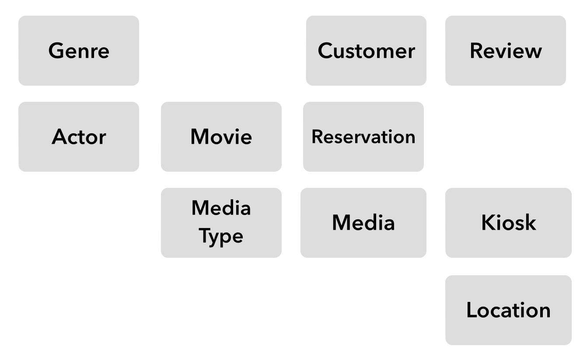

---

# Media Distribution Domain with
# Bounded Contexts

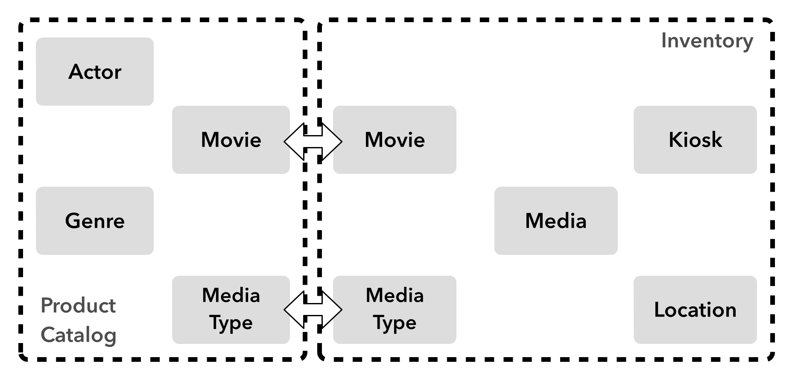

---

# This won't work...

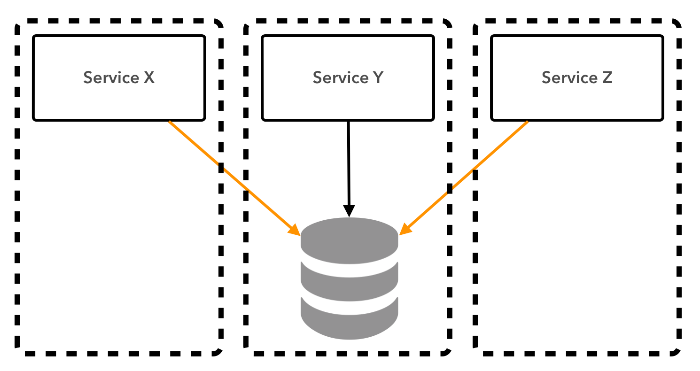

---

# DB per Service

---

# Polyglot Persistence

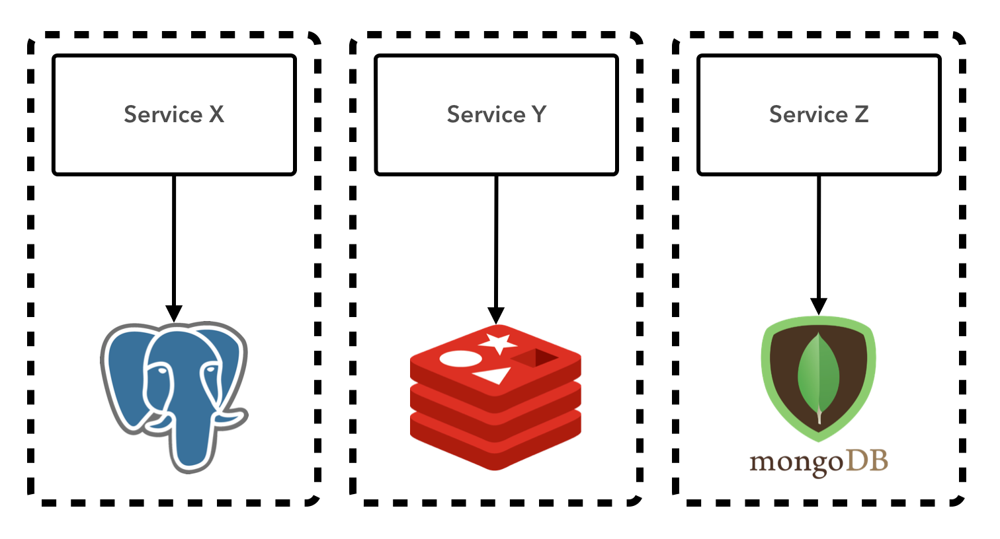

---

# Case Study

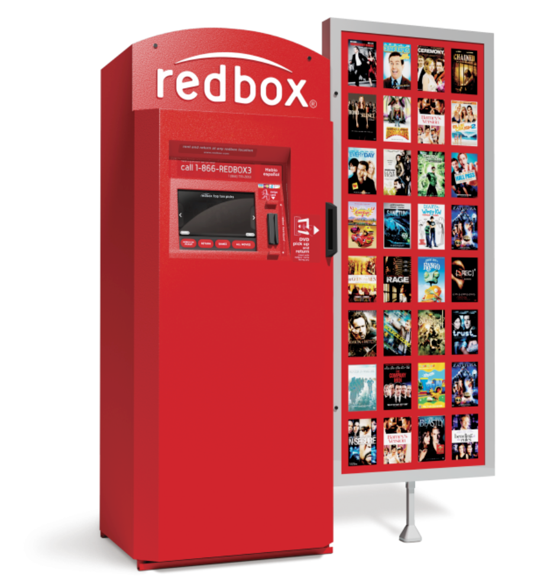

---

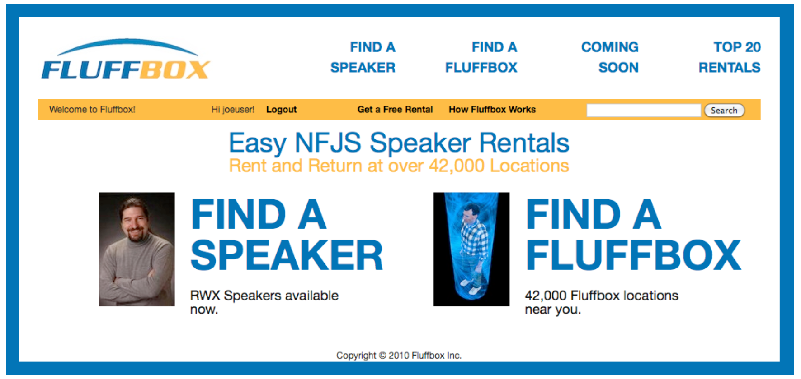

---

# FluffBox Logical Architecture

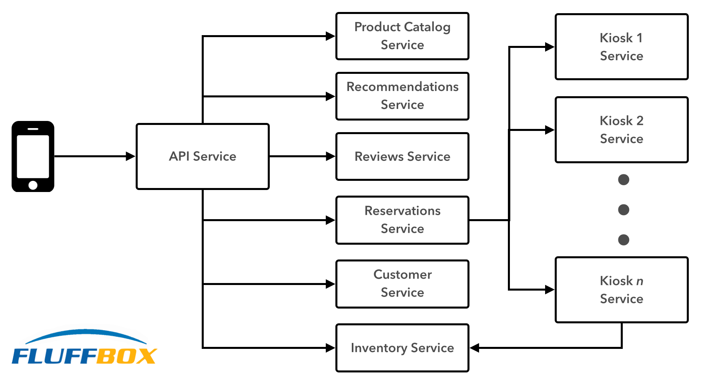

---

# Three problems:

* Spanning Transactions
* Data Synchronization
* Spanning Queries

---

# Spanning Transactions

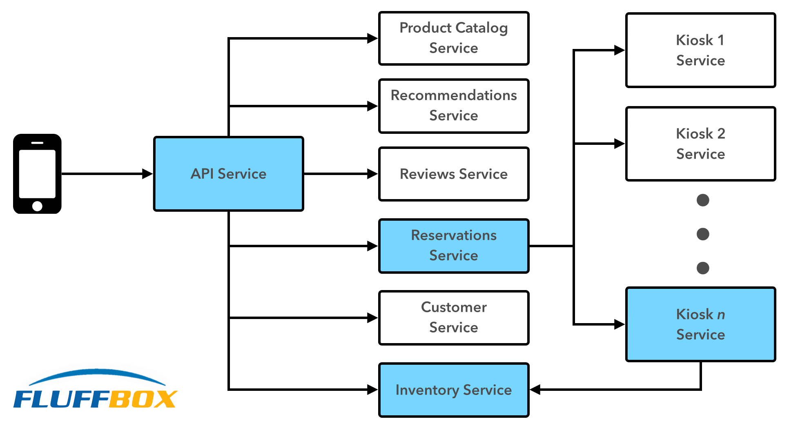

^ When we create a reservation, we need to decrement the available inventory in the inventory service for a given kiosk location. We also need to remove the media from circulation at the kiosk and attach it to a reservation.

---

# Data Synchronization

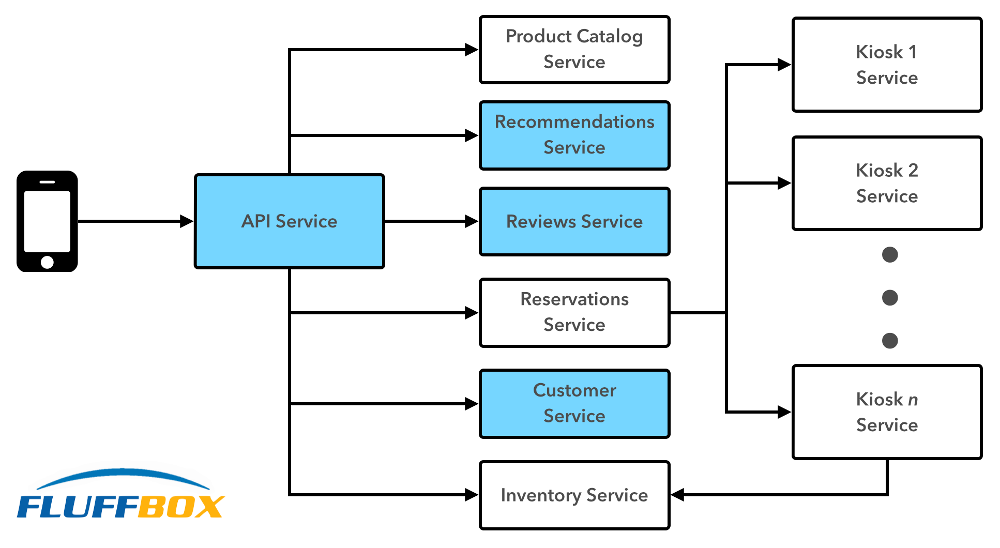

^ When we create a new customer record, we need to create pointers to that customer record within the reviews and recommendations service so that when that customer creates a recommendation or a review, there will be an appropriate reference entity present.

---

# Spanning Queries

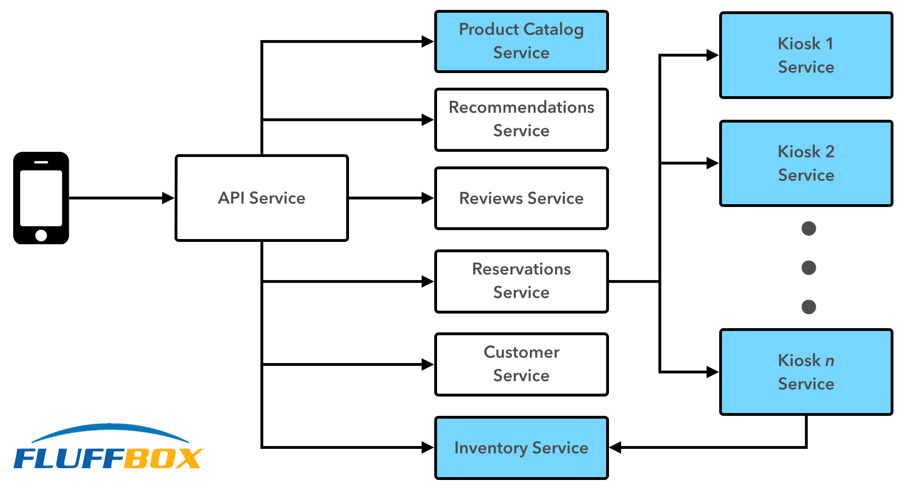

^ We'd like to know what movie genres are most popular in what geographic locations. This will allow us to practice intelligent logistics by sending the right distribution of each genre to each region.

---

# [fit] _Distributed_
# [fit] Systems

---

# Constrained by two factors:

1. The Number of Nodes
2. The Distance Between Nodes

---

> As the number of nodes increases, the probability of failure in the system increases.

---

> As the distance between nodes increases, the minimum latency for communication between nodes increases.

---

# [fit] Failure
# [fit] and
# [fit] Latency
make solving our problems harder

<!--
Why are these challenges? We've created a distributed system...

 http://bravenewgeek.com/distributed-systems-are-a-ux-problem/
http://bravenewgeek.com/if-state-is-hell-soa-is-satan/
http://bravenewgeek.com/from-mainframe-to-microservice-an-introduction-to-distributed-systems/
http://bravenewgeek.com/scaling-shared-data/
-->

---

# [fit] CAP
# [fit] Theorem

<!--
CAP Theorem

http://ferd.ca/beating-the-cap-theorem-checklist.html
http://book.mixu.net/distsys/single-page.html#abstractions
-->

---

# Of these three properties:

* **Consistency:** all nodes see the same data at the same time.
* **Availability:** node failures do not prevent survivors from continuing to operate.
* **Partition tolerance:** the system continues to operate despite message loss due to network and/or node failure.

Only two can be satisfied simultaneously.

---

# Possibilities?

* CA
* CP
* AP

---

# [fit] CA?

---

# [fit] ~~CA~~

---

> Fallacy #1 of Distributed Computing: The Network is Reliable
-- https://blogs.oracle.com/jag/resource/Fallacies.html

---

# Two-Phase Commit

1. Coordinator asks all participating processes to execute their local portion and vote to commit or abort.
2. Coordinator decides to commit or abort and notifies the participating processes.

Does **NOT** account for network partitions!

^ It is a blocking protocol. If the coordinator fails permanently, some cohorts will never resolve their transactions: After a cohort has sent an agreement message to the coordinator, it will block until a commit or rollback is received.

<!--
Discuss CA - you must be Partition Tolerant

http://codahale.com/you-cant-sacrifice-partition-tolerance/
http://bravenewgeek.com/cap-and-the-illusion-of-choice/
-->

---

# [fit] CP?

---

# [fit] _**Strong**_
# [fit] Consistency

^ Strong consistency requires that nodes communicate and agree on every operation. In the presence of a network partition then, systems must stop writing until they can again communicate. So we sacrifice availability.

---

# Partition Tolerant Consensus Algorithms

* **Paxos:** [http://research.microsoft.com/users/lamport/pubs/lamport-paxos.pdf](http://research.microsoft.com/users/lamport/pubs/lamport-paxos.pdf)
* **Raft:** [https://ramcloud.stanford.edu/wiki/download/attachments/11370504/raft.pdf](https://ramcloud.stanford.edu/wiki/download/attachments/11370504/raft.pdf)
* **Zab:** [http://labs.yahoo.com/publication/a-simple-totally-ordered-broadcast-protocol/](http://labs.yahoo.com/publication/a-simple-totally-ordered-broadcast-protocol/)

^ If you haven't read and deeply understood these papers, you shouldn't attempt this. Friends don't let friends implement strong consensus algorithms.

<!--
http://bravenewgeek.com/understanding-consensus/
http://bravenewgeek.com/you-cannot-have-exactly-once-delivery/
-->

---

# [fit] AP?

---

# [fit] _**Eventual**_
# [fit] Consistency

^ More formally we're talking about weak consistency, of which eventual consistency is a class. In this model, using some algorithm, all replicas eventually agree on a value.

<!--
BASE? http://queue.acm.org/detail.cfm?id=1394128
--->

---

> Of these two realistic alternatives, eventually consistent systems (which are availble and partition tolerant) are easier to implement correctly and will be our focus.

---

# [fit] IMPORTANT
# I said _easier_, not easy.

---

# [fit] Aside:
# _Compensating Transactions_

---

# Compensating Transactions

- A type of eventual consistency.
- A coordinator keeps track of each particpant's commit or abort status
- If any participant aborts, the coordinator requests compensating (or "undo") operations on the participants that committed.
- These can have negative consequences because they can create tight coupling between services.

---

# [fit] Event-Driven
# [fit] Architecture

<!--
https://github.com/cer/event-sourcing-examples/wiki/WhyEventDrivenArch
https://en.wikipedia.org/wiki/Event-driven_architecture
-->

^ In an event-driven application services publish and consume events. A service publishes an event whenever it changes the state of an entity. Another service can subscribe to that event and update its own entities and possibly publish other events. You can implement a business transaction that updates multiple entities as a series of steps, each of which updates one entity and publishes an event that triggers the next step. Also, a service can maintain the consistency of a replica by subscribing to the events that are published when the master copy is updated.

---

# Solution #1: Raw Events

When a service updates its data model, it also **ATOMICALLY** publishes events that can be consumed by other services.

Can address:

* Spanning Transactions
* Data Synchronizaion

---

# Reservation Service creates a Reservation in its DB

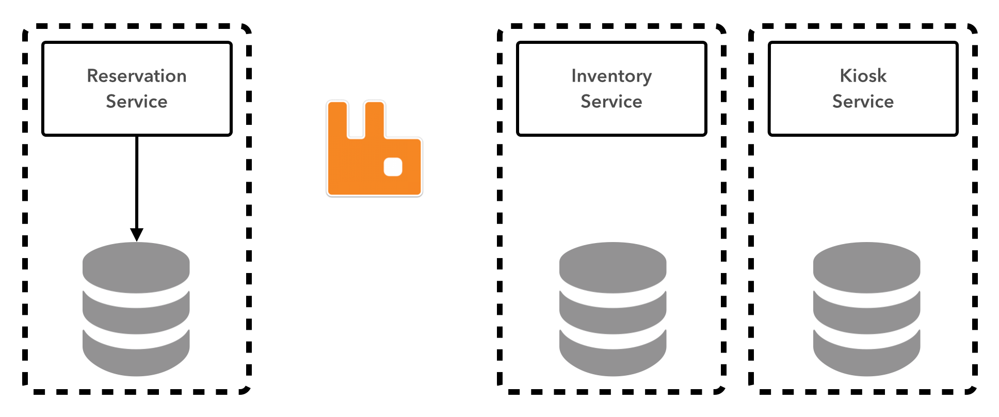

---

# Reservation Service publishes a ReservationCreated event

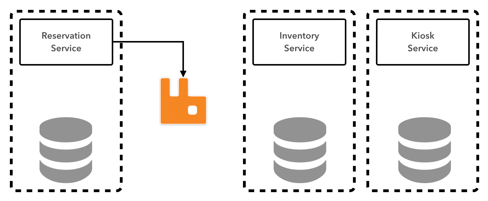

---

# Inventory and Kiosk Services subscribe to ReservationCreated events

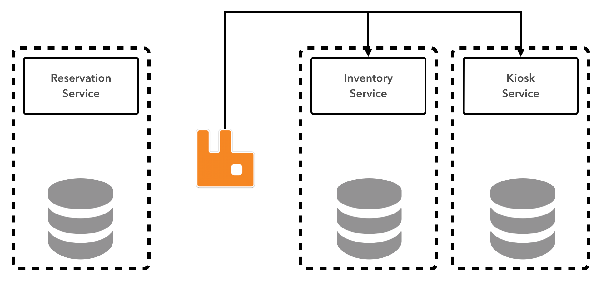

---

# Inventory and Kiosk Services update their DBs

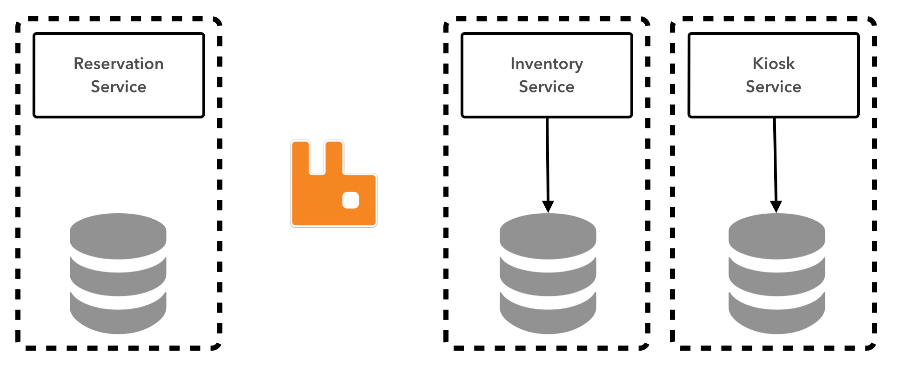

---

# Pros of Solution #1

* Easiest solution to understand
* Can achieve limited transactionality with some DB and message broker combos
* Can use a shared data store as a message queue (o_0)
* Some persistence frameworks support event generation (Hibernate, Spring Data REST)

<!--
http://www.confluent.io/blog/2015/04/23/bottled-water-real-time-integration-of-postgresql-and-kafka/
-->

---

# Cons of Solution #1

* Non-transactional data stores (NoSQL)
* Framework support often disconnects from the business-level event
* Tangling of event publishing with business logic
* Might forget to publish the events!

---

# [fit] Aside:
# _the Log_

---

> The log is real-time data's unifying abstraction.
-- http://engineering.linkedin.com/distributed-systems/log-what-every-software-engineer-should-know-about-real-time-datas-unifying

<!--
http://www.confluent.io/blog/2015/01/29/making-sense-of-stream-processing/
-->

---

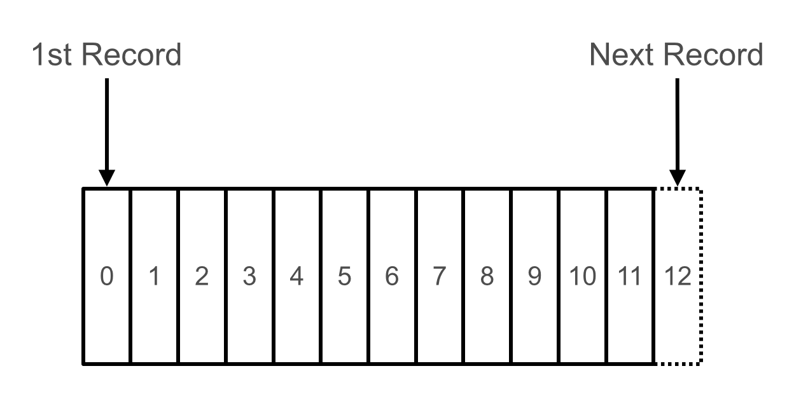

An append-only, totally-ordered sequence of records ordered by time.

^ The answer is that logs have a specific purpose: they record what happened and when. For distributed data systems this is, in many ways, the very heart of the problem.

---

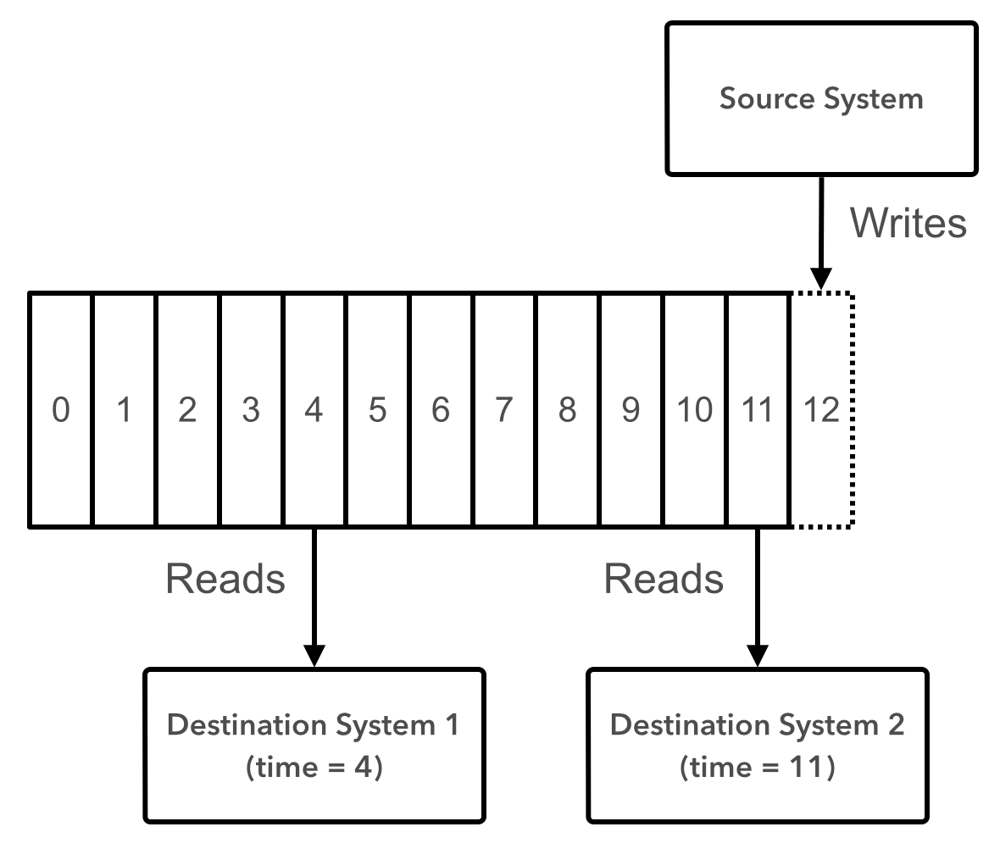

^ Destination system stays in sync by subscribing to events in the log. If data loss/corruption occurs, system can be reconstituted by replaying from the beginning.

---

# Where is the Log used?

* Implementation of ACID transasctions
* Primary-Backup Replication
* State-Machine Replication
* Event Sourcing / CQRS
* Stream Processing

---

# Solution #2: Event Sourcing/CQRS

Can address:

* Spanning Transactions
* Data Synchronizaion

---

# Event Sourcing

* Instead of persisting current state (i.e. update in place), a service persists domain change events to an event store.
* The event store acts as a DB, in that it supports persistence/retrieval of events by PK.
* The event store acts as a message bus, in that consumers can subscribe to events in which they are interested.

<!--
http://docs.geteventstore.com/introduction/event-sourcing-basics/
http://martinfowler.com/eaaDev/EventSourcing.html
https://github.com/cer/event-sourcing-examples/wiki/WhyEventSourcing
http://www.infoq.com/presentations/microservices-docker-cqrs
-->

---

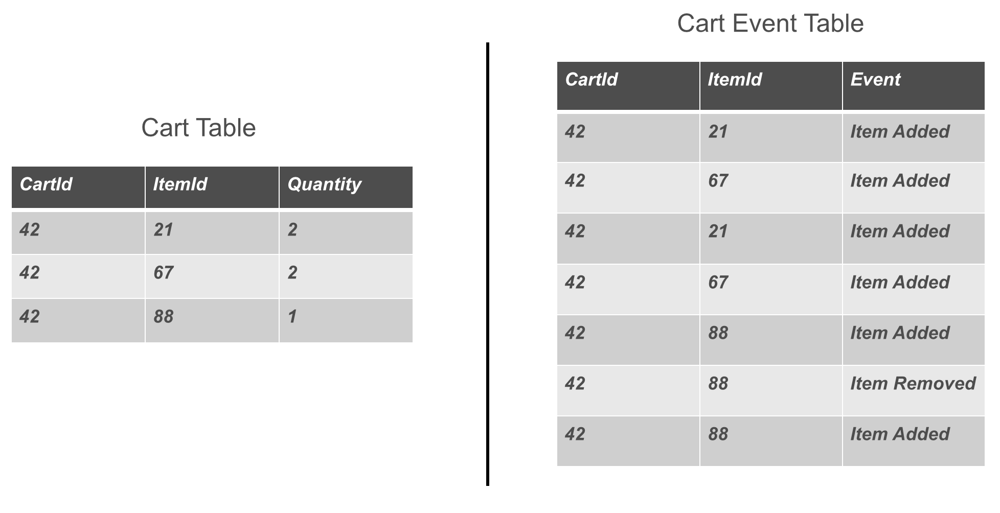

---

# CQRS

* **C**ommand **Q**uery **R**esponsibility **S**egregation
* Separates command processing from query processing
* Required for event sourcing to support more complex queries than find by PK.

---

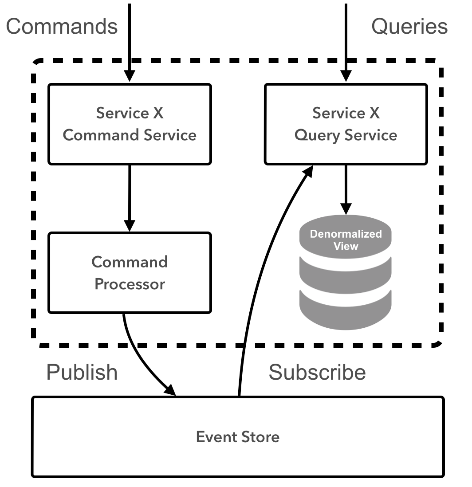

<!--
https://code.google.com/p/ddd-cqrs-sample/
http://martinfowler.com/bliki/CQRS.html

TODO: discuss sagas?

http://blog.jonathanoliver.com/cqrs-sagas-with-event-sourcing-part-i-of-ii/
http://programmers.stackexchange.com/questions/157323/ddd-saga-event-sourcing-can-a-compensate-action-simply-be-a-delete-on-the-ev
http://kellabyte.com/2012/05/30/clarifying-the-saga-pattern/
-->

---

# Data Stores

* **Kafka**:  [http://kafka.apache.org](http://kafka.apache.org)
* **EventStore**: [(http://geteventstore.com)](http://geteventstore.com)
* **Datomic**: [(http://www.datomic.com)](http://www.datomic.com)

---

# App Frameworks

* **Axon**: [http://www.axonframework.org](http://www.axonframework.org)
* **Jdon**: [http://en.jdon.com](http://en.jdon.com)

---

# Pros of Solution #2

* Spanning transactions are captured as a sequence of correlated log events.
* Data synchronization is accomplished as multiple contexts update local query state based on event subscriptions.
* Bugs and failures don't cause unrecoverable state corruption.
* Clean separation of concerns.

---

# Cons of Solution #2

* Not the natural programming model we're used to!
* Many more moving parts - complicated to implement correctly.
* Requires a **deep** understanding of the domain model to properly represent events.
* Many supporting technologies not as mature as traditional persistence solutions.

---

# Solution #3: Stream Processing

Can address:

* Data Synchronizaion (noodle)
* Spanning Queries

---

# Lambda Architecture

---

# Lambda Architecture Resources

* [http://nathanmarz.com/blog/how-to-beat-the-cap-theorem.html](http://nathanmarz.com/blog/how-to-beat-the-cap-theorem.html)
* [http://lambda-architecture.net](http://lambda-architecture.net)

---

# Kappa Architecture

---

# Kappa Architecture Resources

- [http://radar.oreilly.com/2014/07/questioning-the-lambda-architecture.html](http://radar.oreilly.com/2014/07/questioning-the-lambda-architecture.html)
- [http://www.kappa-architecture.com](http://www.kappa-architecture.com)

---

# Supporting Techology

* **Samza**: [http://samza.apache.org](http://samza.apache.org)
* **Spring XD**: [http://projects.spring.io/spring-xd](http://projects.spring.io/spring-xd)
* **Spring Bus/Stream**: [http://github.com/spring-projects/spring-bus](http://github.com/spring-projects/spring-bus)
* **Storm**: [http://storm.apache.org](http://storm.apache.org)
* **Spark Streaming**: [http://spark.apache.org/streaming](http://spark.apache.org/streaming)

<!--
Samza http://samza.apache.org/learn/documentation/0.7.0/container/state-management.html
https://spring.io/blog/2015/04/15/using-apache-kafka-for-integration-and-data-processing-pipelines-with-spring
https://github.com/spring-projects/spring-integration-kafka

Spring Bus/Stream https://github.com/spring-projects/spring-bus/blob/master/roadmap.md
-->

---

# Pros of Solution #3

* If events are already being published (via #1 or #2), these can pipe directly into a stream.
* Many mature and powerful tools available for stream processing.
* Data can be flexibly combined/recombined in interesting ways.

---

# Cons of Solution #3

* Composing events from multiple bounded contexts requires a breadth of understanding of the enterprise domain.
* Can be complicated and expensive to construct these pipelines.
* Security and compliance solutions in "data lake" style solutions still immature.

---

# Summary

* Adopting microservices introduces new data challenges.
* Traditional transactional approaches don't account for distributed system realities.
* Understand the CAP theorem and its tradeoffs!
* Understand and apply data architecture patterns when they make sense for your context.
