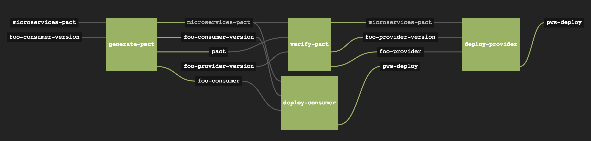
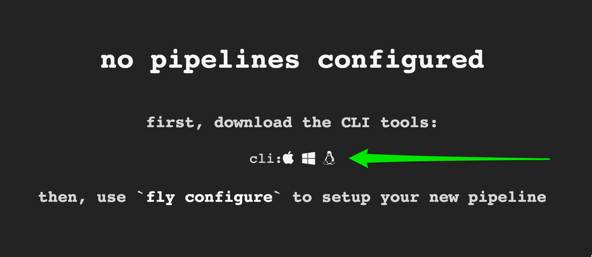
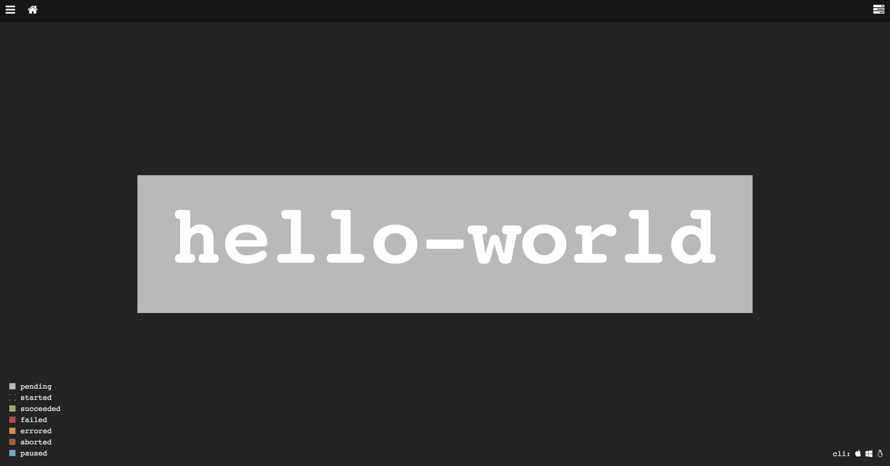
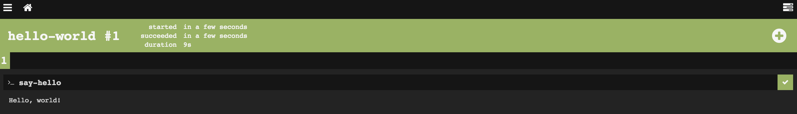

footer: © 2015 Matt Stine
slidenumbers: true
autoscale: true

# [fit] Concourse:
# [fit] CI that scales with your project


---


# Me

Matt Stine [@mstine](http://twitter.com/mstine)
Senior Product Manager
Pivotal
[matt.stine@gmail.com](mailto:matt.stine@gmail.com)

---


# I wrote a little cloud book...

FREE - Compliments of Pivotal

[http://bit.ly/cloud-native-book](http://bit.ly/cloud-native-book)

---

# Because the world needed another CI system...
# [fit] 0_o

---

# [fit] Why?


---

# [fit] Simplicity

^ - shouldn't have to know the guts
- should be able to learn in one sitting
- 3 primitives - tasks/resources/jobs - allow the expression of arbitrary features and pipelines

---

# [fit] Usability

---

# [fit] Build Isolation


---

# [fit] Scalable/Reproducible deployment


http://bosh.io

---

# [fit] Flexibility

---

# [fit] _Local_
# [fit] Iteration

---

# [fit] Concepts


---

# Running Example:

- Consumer-Driven Contract Testing ([http://martinfowler.com/articles/consumerDrivenContracts.html](http://martinfowler.com/articles/consumerDrivenContracts.html))
- Using Pact-JVM ([https://github.com/DiUS/pact-jvm](https://github.com/DiUS/pact-jvm))
- Example Project ([https://github.com/mstine/microservices-pact](https://github.com/mstine/microservices-pact))

---

# [fit] Tasks
# _execution of a script in an isolated environment with dependent resources made available to it_

---

```
---
platform: linux
image: docker:///java#8
inputs:
- name: microservices-pact
  path: .
- name: foo-consumer-version
  path: .
params:
    TERM: dumb
run:
  path: ./gradlew
  args:
  - test
  - assemble
```

---

```
platform: linux
image: docker:///java#8
inputs:
- name: microservices-pact
  path: .
- name: pact
  path: .
- name: foo-provider-version
  path: .
params:
  TERM: dumb
  PACT_FILE: ./Foo_Consumer-Foo_Provider.json
run:
   path: ./gradlew
   args:
   - assemble
   - pactVerify
```

---

# [fit] Resources
# _data: inputs/outputs_

---

# Can be...

- Checked
- Fetched
- Pushed

---

# Git

```
- name: microservices-pact
  type: git
  source:
    uri: https://github.com/mstine/microservices-pact.git
```

---

# S3 Bucket

```
- name: foo-consumer
  type: s3
  source:
    access_key_id: {{access_key_id}}
    secret_access_key: {{secret_access_key}}
    bucket: concourse-pact
    regexp: microservices-pact-consumer-.*.jar$
```

---

# Semantic Versioning

```
- name: foo-consumer-version
  type: semver
  source:
    bucket: concourse-pact
    key: foo-consumer-version
    access_key_id: {{access_key_id}}
    secret_access_key: {{secret_access_key}}
    initial_version: 0.1.0
```

---

# Cloud Foundry!

```
- name: pws-deploy
  type: cf
  source:
    api: https://api.run.pivotal.io
    username: {{pws_username}}
    password: {{pws_password}}
    organization: platform-eng
    space: concourse-demo
    skip_cert_check: false
```

---

# [https://github.com/concourse?query=resource](https://github.com/concourse?query=resource)

- pool
- git
- vagrant-cloud
- docker-image
- cf
- s3
- cf service-broker
- bosh-deployment
- bosh-io-release
- bosh-io-stemcell
- pivotal tracker
- archive (tgz)
- semver
- github-release
- time

---

# [fit] Implement Your Own
[http://concourse.ci/implementing-resources.html](http://concourse.ci/implementing-resources.html)

---

# [fit] Jobs
# _functions composed of behavior (tasks) and inputs/outputs (resources/other jobs)_

---

# Jobs Have Builds

- Success (all tasks succeed)
- Failure (any task fails)
- Can be accessed while running/shortly after finish (intercept/hijack)

---

# Jobs Have Plans

- Sequence of steps to execute:
- _get_ resources
- run things (_task_)
- _put_ resources
- parallel or serial

---

# Verify Pact (inputs)

```
- get: microservices-pact
  passed: [generate-pact]
  trigger: true
- get: foo-provider-version
  params: {bump: minor, pre: alpha}
- get: pact
  trigger: true
```

---

# Verify Pact (function)

```
- task: verify-pact
  file: microservices-pact/microservices-pact-provider/task.yml
```

---

# Verify Pact (task)

```
platform: linux
image: docker:///java#8
inputs:
- name: microservices-pact
  path: .
- name: pact
  path: .
- name: foo-provider-version
  path: .
params:
  TERM: dumb
  PACT_FILE: ./Foo_Consumer-Foo_Provider.json
run:
   path: ./gradlew
   args:
   - assemble
   - pactVerify
```

---

# Verify Pact (outputs)

```
- put: foo-provider
  params: {from: microservices-pact-provider/build/libs/microservices-pact-provider-.*.jar$}
- put: foo-provider-version
  params: {file: foo-provider-version/number}
```

---

# [fit] Pipelines


---



---

# [fit] That's
# [fit] It


---

# [fit] Learning to Fly


---

# Getting Started

```
$ git clone https://github.com/concourse/concourse.git
$ vagrant init concourse/lite
$ vagrant up
```

---

# http://192.168.100.4:8080



---

# Let's do this...

```
jobs:
- name: hello-world
  plan:
  - task: say-hello
    config:
      platform: linux
      image: "docker:///busybox"
      run:
        path: echo
        args: ["Hello, world!"]
```

---

# Ship It!

```
$ fly configure hello-world hello-world-pipeline.yml
```

---



---



---

# [fit] Let's Play


---

# Thanks!

_Matt Stine_ ([@mstine](http://twitter.com/mstine))

* _This Presentation:_ [https://github.com/mstine/nfjs_2015/tree/master/Concourse](https://github.com/mstine/nfjs_2015/tree/master/Concourse)
* _Example Project:_ [https://github.com/mstine/microservices-pact](https://github.com/mstine/microservices-pact)
* _Concourse Website:_ [http://concourse.ci](http://concourse.ci)
* _Concourse Slack Team:_ [https://concourseci.slack.com](https://concourseci.slack.com)
