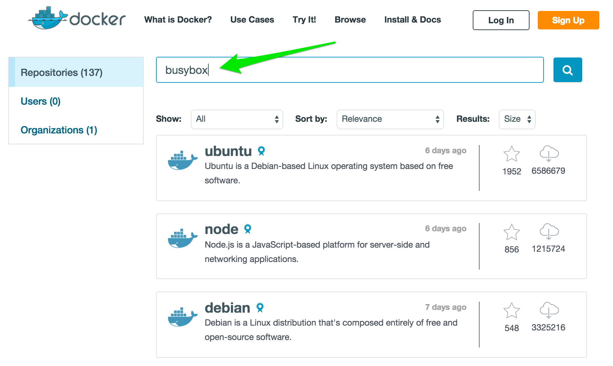
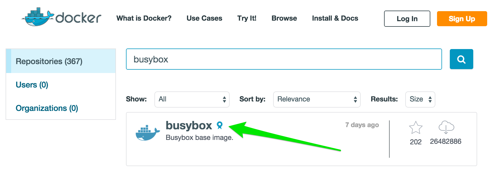
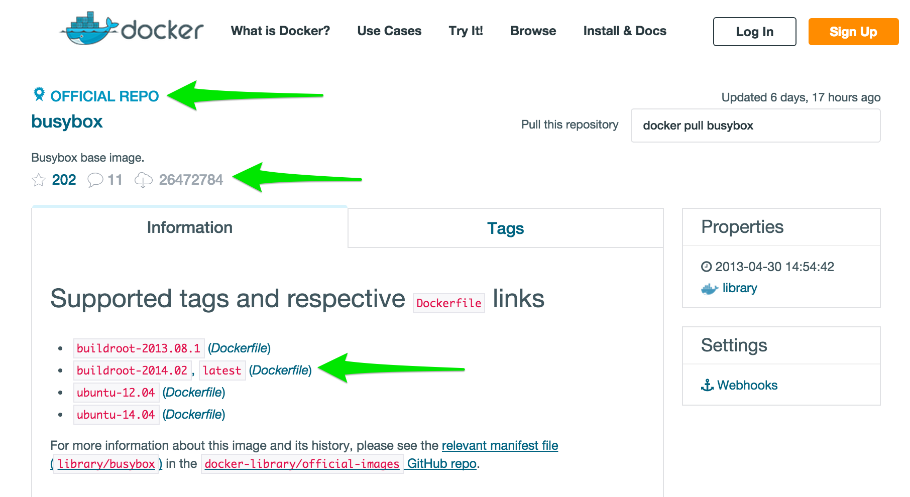

= Lab 1 - Hello Docker!

In this lab we'll explore the basics of the Docker pull/run workflow.

NOTE: If you've pre-warmed your cache per link:../setup.html[the setup docs], your output might be slightly different than what's seen here!

== Find Busybox in Docker Hub

. Visit https://registry.hub.docker.com/search?q=library[Docker Hub]. In the search bar, enter ``busybox'' and click the search icon:
+

. In the results, click on the official busybox image:
+

. In the resulting detail page, you can learn many things about the busybox image:
+

+
For example:
+
* You can see how https://docs.docker.com/docker-hub/official_repos/[official repos] are designated.
* You can see how many times a particular image has been pulled (in this screenshot, 26472784 times!).
* You can view the currently supported _tags_ and the _Dockefiles_ from which they've been created (more on these later!).
* If you continue to scroll down, you'll learn interesting information about how to use this image.
+
This style image documentation can be considered to be ``best practice.''

== Pull Busybox

. At a Docker-enabled terminal, pull the busybox image:
+
----
$ docker pull busybox
----
+
Eventually you'll see output similar to the following:
+
----
latest: Pulling from busybox <1>
cf2616975b4a: Pull complete <2>
6ce2e90b0bc7: Pull complete
8c2e06607696: Already exists <3>
busybox:latest: The image you are pulling has been verified. Important: image verification is a tech preview feature and should not be relied on to provide security.

Digest: sha256:38a203e1986cf79639cfb9b2e1d6e773de84002feea2d4eb006b52004ee8502d
Status: Downloaded newer image for busybox:latest
----
<1> We are pulling the `latest` tag for the busybox image.
<2> Docker images are constructed from layers. This line indicates that we have pulled the layer with ID `cf2616975b4a`.
<3> We already had the layer with ID `8c2e06607696` in our cache, so there was no need to pull it.

== Run a Container using Busybox

. Now that we've pulled the busybox image, let's run a container with it:
+
----
$ docker run busybox echo hello world
----
+
You should get exactly what you asked for:
+
----
hello world
----

. We can also get an interactive terminal allowing us to treat the busybox container similarly to a remote shell:
+
----
$ docker run -it busybox
/ #
----
+
At the resulting shell prompt, you can try basic commands:
+
----
/ # ls -l
total 48
drwxrwxr-x    2 root     root          4096 May 22  2014 bin
drwxr-xr-x    5 root     root           380 Jul 21 04:36 dev
drwxr-xr-x    6 root     root          4096 Jul 21 04:36 etc
drwxrwxr-x    4 root     root          4096 May 22  2014 home
drwxrwxr-x    2 root     root          4096 May 22  2014 lib
lrwxrwxrwx    1 root     root             3 May 22  2014 lib64 -> lib
lrwxrwxrwx    1 root     root            11 May 22  2014 linuxrc -> bin/busybox
drwxrwxr-x    2 root     root          4096 Feb 27  2014 media
drwxrwxr-x    2 root     root          4096 Feb 27  2014 mnt
drwxrwxr-x    2 root     root          4096 Feb 27  2014 opt
dr-xr-xr-x  124 root     root             0 Jul 21 04:36 proc
drwx------    2 root     root          4096 Jul 21 04:36 root
lrwxrwxrwx    1 root     root             3 Feb 27  2014 run -> tmp
drwxr-xr-x    2 root     root          4096 May 22  2014 sbin
dr-xr-xr-x   13 root     root             0 Jul 21 04:36 sys
drwxrwxrwt    3 root     root          4096 May 22  2014 tmp
drwxrwxr-x    6 root     root          4096 May 22  2014 usr
drwxrwxr-x    4 root     root          4096 May 22  2014 var
----
