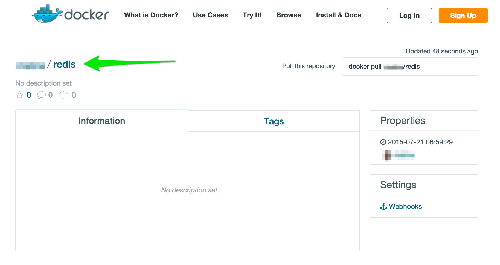

= Lab 4 - Getting to Know Dockerfiles

In this lab we are going to build and test a Docker image for http://redis.io/[Redis]. Instead of doing it manually, we will use a Dockerfile. We will also push our new image to Docker Hub and pull it.

NOTE: An official Redis image exists, and we'll use it later. However, the image we're creating now is strictly for training purposes.

You can find our example Dockerfile at `ContainersWorkshop/code/redis/Dockerfile`:

====
----
include::../code/redis/Dockerfile[]
----
<1> The `FROM` instruction tells Docker to start with `debian` as a base image.
<2> The `MAINTAINER` instruction is simply metadata indicating who created and maintains this image.
<3> The `RUN` instructions run commands in an intermediate container and then commit the result. You'll see how this turns into layers in a moment.
<4> The `ENTRYPOINT` instruction tells Docker what process should start any time a container is started from this image.
<5> The `EXPOSE` command exposes the Redis point for linking (we'll get to this later!).
====

. At a Docker-enabled terminal, run a new interactive container based on the `debian` image:
+
====
----
$ cd code/redis
$ docker build -t <your hub username>/redis .
Sending build context to Docker daemon 2.048 kB
Sending build context to Docker daemon
Step 0 : FROM debian
 ---> 9a61b6b1315e <1>
Step 1 : MAINTAINER Matt Stine matt.stine@gmail.com
 ---> Running in ec19219c2b5a <2>
 ---> 0a44a8958e00 <3>
Removing intermediate container ec19219c2b5a <4>
Step 2 : RUN apt-get update
 ---> Running in f00b2761f3a5
Get:1 http://security.debian.org jessie/updates InRelease [63.1 kB]

...

Reading package lists...
 ---> 09c910eb2dd7
Removing intermediate container f00b2761f3a5
Step 3 : RUN apt-get -y install redis-server
 ---> Running in 52947e6c384d
Reading package lists...

...

Processing triggers for systemd (215-17+deb8u1) ...
 ---> 440974b8abf7
Removing intermediate container 52947e6c384d
Step 4 : ENTRYPOINT /usr/bin/redis-server
 ---> Running in ef1434265b25
 ---> 86b1f40bec1d
Removing intermediate container ef1434265b25
Step 5 : EXPOSE 6379
 ---> Running in 27793d20becb
 ---> e34bade7d2dd
Removing intermediate container 27793d20becb
Successfully built e34bade7d2dd <5>
----
<1> Docker indicates that it is using image ID `9a61b6b1315e` in place of `debian`.
<2> Docker creates an intermediate container with ID `ec19219c2b5a` to execute the `MAINTAINER` instruction.
<3> Docker commits the intermediate container as a new image layer with ID `0a44a8958e00`.
<4> Docker deletes the intermediate container with ID `ec19219c2b5a`.
<5> Docker indicates that the image ID for the newly created image is `e34bade7d2dd`. We have tagged this image <your hub username>/redis.
====

. Start a new container based on the image you just created and expose port 6379:
+
----
$ docker run -p 6379:6379 mstine/redis
[6] 21 Jul 12:36:11.082 # Warning: no config file specified, using the default config. In order to specify a config file use /usr/bin/redis-server /path/to/redis.conf
                _._
           _.-``__ ''-._
      _.-``    `.  `_.  ''-._           Redis 2.8.17 (00000000/0) 64 bit
  .-`` .-```.  ```\/    _.,_ ''-._
 (    '      ,       .-`  | `,    )     Running in stand alone mode
 |`-._`-...-` __...-.``-._|'` _.-'|     Port: 6379
 |    `-._   `._    /     _.-'    |     PID: 6
  `-._    `-._  `-./  _.-'    _.-'
 |`-._`-._    `-.__.-'    _.-'_.-'|
 |    `-._`-._        _.-'_.-'    |           http://redis.io
  `-._    `-._`-.__.-'_.-'    _.-'
 |`-._`-._    `-.__.-'    _.-'_.-'|
 |    `-._`-._        _.-'_.-'    |
  `-._    `-._`-.__.-'_.-'    _.-'
      `-._    `-.__.-'    _.-'
          `-._        _.-'
              `-.__.-'

[6] 21 Jul 12:36:11.083 # Server started, Redis version 2.8.17
----

. From a separate terminal window, identify your boot2docker IP address and telnet to the Redis server instance:
+
----
$ boot2docker ip
192.168.59.103

$ telnet 192.168.59.103 6379
Trying 192.168.59.103...
Connected to 192.168.59.103.
Escape character is '^]'.
set hello nfjs
+OK
get hello
$4
nfjs
----

. Exit the telnet session, and kill and remove the running Redis container:
+
----
$ docker kill 8a98d4110fcb && docker rm 8a98d4110fcb
8a98d4110fcb
8a98d4110fcb
----

. Login to Docker Hub from the CLI:
+
----
$ docker login
Username: <your hub username>
Password:
Email: <your hub email>
WARNING: login credentials saved in /Users/pivotal/.docker/config.json
Login Succeeded
----

. Push your new Redis Docker image:
+
----
$ docker push <your hub username>/redis
The push refers to a repository [<your hub username>/redis] (len: 1)
e34bade7d2dd: Image already exists
86b1f40bec1d: Image successfully pushed
440974b8abf7: Image successfully pushed
09c910eb2dd7: Image successfully pushed
0a44a8958e00: Image successfully pushed
9a61b6b1315e: Image already exists
902b87aaaec9: Image successfully pushed
Digest: sha256:11dfcc780090042b177da9c774e5e5d8629a00ef2856787a44006fd61c687e03
----

. Delete your local copy of the Redis image:
+
----
$ docker rmi <your hub username>/redis
Untagged: <your hub username>/redis:latest
Deleted: e34bade7d2dd2d55c324190e9af16895e8a0273950b66335e8b62a228f364a4f
Deleted: 86b1f40bec1d441c69ed41d613b93efee57c57eadea33f36d50cdd67a601aba4
Deleted: 440974b8abf7ecc0a2926b31d0f4146a5b48d669f32ed48600257c4e2eceda92
Deleted: 09c910eb2dd7510e3538fe9e7f927556538763c5c4a7201f285974979e240750
Deleted: 0a44a8958e00ce148e2ba9853fef231f9df10958c6c35f9024c7111c196a5d62
----

. Start a new container based on the image you just created. This time you should see Docker pull image layers:
+
----
$ docker run -p 6379:6379 <your hub username>/redis
Unable to find image '<your hub username>/redis:latest' locally
latest: Pulling from <your hub username>/redis0a44a8958e00: Pull complete
09c910eb2dd7: Pull complete
440974b8abf7: Pull complete
86b1f40bec1d: Pull complete
e34bade7d2dd: Already exists
902b87aaaec9: Already exists
9a61b6b1315e: Already exists
Digest: sha256:11dfcc780090042b177da9c774e5e5d8629a00ef2856787a44006fd61c687e03
Status: Downloaded newer image for <your hub username>/redis:latest
[5] 21 Jul 13:01:42.113 # Warning: no config file specified, using the default config. In order to specify a config file use /usr/bin/redis-server /path/to/redis.conf
----

. You can also see your newly created image in Docker Hub:
+

