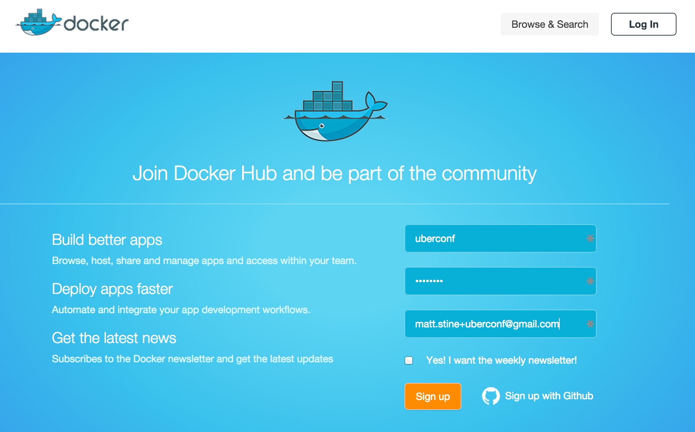
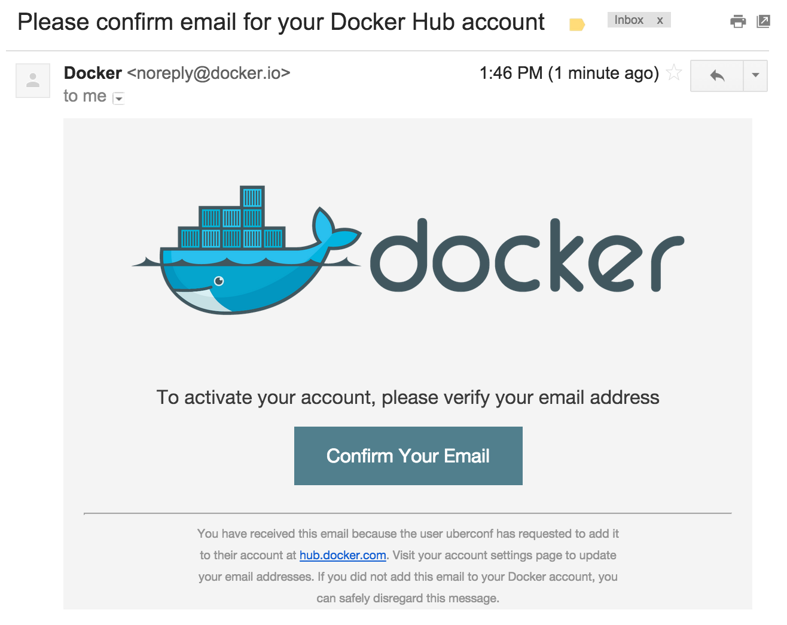

:compat-mode:
= Set Up Your Environment!

== Sign Up for a Docker Hub Account

If you haven't already, create an account on Docker Hub that you can use when we push images.

. In a browser, navigate to https://hub.docker.com/account/signup.

. Fill out the form and click *Sign up*:
+

. Activate your account by clicking *Confirm Your Email* in the email you receive from Docker Hub:
+

== Set Up Prerequisites

. Install *Docker* for your particular operating system by following the appropriate instructions:
* http://docs.docker.com/mac/step_one/[Mac OS X]
* http://docs.docker.com/windows/step_one/[Windows]
* http://docs.docker.com/linux/step_one/[Linux]
+
You only need to complete the instructions on the page titled _Install Docker for..._
+
If you want to use your own terminal configuration (i.e. not the one provided by boot2docker), you need to set three environment variables in your shell. They are provided to you at the end of the boot2docker installation. Here is an example of what you're looking for:
+
[source,shell]
----
$ export DOCKER_HOST=tcp://192.168.59.104:2376
$ export DOCKER_CERT_PATH=/Users/pivotal/.boot2docker/certs/boot2docker-vm
$ export DOCKER_TLS_VERIFY=1
----

. Install *Docker Compose* for OS X or Linux by running the following commands from the terminal:
+
[source,shell]
----
$ curl -L https://github.com/docker/compose/releases/download/1.3.3/docker-compose-`uname -s`-`uname -m` > /usr/local/bin/docker-compose

$ chmod +x /usr/local/bin/docker-compose
----
+
NOTE: If you get a ``Permission denied'' error, your `/usr/local/bin directory` probably isn’t writable and you’ll need to install Compose as the superuser. Run `sudo -i`, then the two commands above, then `exit`.
+
Docker Compose is not yet supported natively on Windows. To run on Windows, you can follow the instructions found https://github.com/dduportal-dockerfiles/docker-compose#how-do-you-use-this-image-[here]. They demonstrate how to run Docker Compose inside a container using your boot2docker machine.

. Install *Lattice* by following the instructions found http://lattice.cf/docs/getting-started/[here]. You will need to complete the following sections of the _Getting Started_ page:
* Pre-Requisites for the Vagrant VM (if you installed Docker first, you should be OK here)
* Starting the Lattice Vagrant VM
* Fetching ltc - the Lattice CLI

== Warm Your Docker Cache

Using a Docker-enabled terminal (either by double-clicking on the boot2docker icon or your own terminal setup as described above), execute the following command:

[source,shell]
----
$ docker run --rm -p 8080:8080 mstine/hello-docker-world
----

This will pull down the OpenJDK 8 Docker image layers we'll be using in the workshop, as well as the image layers for a sample application. It will then start the sample application and expose it on port 8080 on your boot2docker VM.

Once the application starts, you should see the following log message repeat every second:

[source,shell]
----
2015-07-19 18:09:50.718  INFO 1 --- [pool-1-thread-1] ication$$EnhancerBySpringCGLIB$$9613ffef : Hello from HelloDockerWorldApplication!
----

To access the application, identify the port for your boot2docker VM:

[source,shell]
----
$ boot2docker ip
192.168.59.104
----

And then access the application using that IP in the browser. For the IP above, you would access http://192.168.59.104:8080.
